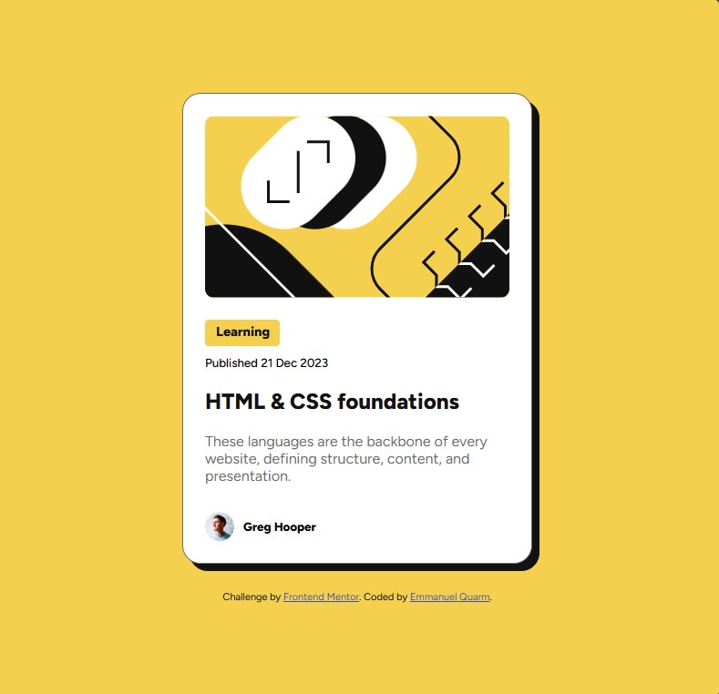

# Frontend Mentor - Blog preview card solution

This is a solution to the [Blog preview card challenge on Frontend Mentor](https://www.frontendmentor.io/challenges/blog-preview-card-ckPaj01IcS). Frontend Mentor challenges help you improve your coding skills by building realistic projects. 

## Table of contents

- [Overview](#overview)
  - [The challenge](#the-challenge)
  - [Screenshot](#screenshot)
  - [Links](#links)
- [My process](#my-process)
  - [Built with](#built-with)
  - [What I learned](#what-i-learned)
  - [Continued development](#continued-development)
  - [Useful resources](#useful-resources)
- [Author](#author)
- [Acknowledgments](#acknowledgments)


## Overview

### The challenge

Users should be able to:

- See hover and focus states for all interactive elements on the page

### Screenshot




### Links

- Solution URL: 
- Live Site URL: https://bigboyemma20.github.io/blog-preview-card-main/

## My process

### Built with

- Semantic HTML5 markup

- CSS custom properties (variables)

- Flexbox for layout

- Mobile-first approach


### What I learned

Through this project I have learnt to:
- Use @media queries for responsive design, adjusting the card's layout and font sizes for smaller screens.

- Implement hover effects like changing the shadow and changing the text color.


```css
@media (max-width: 375px) {
    .card {
      max-width: 327px;
      /* padding: 16px; */
    }
    h1{
        font-size: 20px;
    }
    p{
        font-size: 14px;
    }
    h5,.date{
        font-size: 12px;
    }
    .card-image{
        max-width: 100%;
        /* width: 279px; */
    }
  }

  .card:hover  h1{
    color: var(--Yellow);
}
```


### Continued development

Going forward, I want to focus on learning how to use more advanced CSS techniques like Grid for layouts and CSS animations.


### Useful resources

- https://www.freecodecamp.org/ 
- https://www.w3schools.com/


## Author

- My Github - [Emmanuel Quarm](https://github.com/bigboyemma20)
- Frontend Mentor - [@bigboyemma20](https://www.frontendmentor.io/profile/bigboyemma20)
- Twitter - [@freshmanuel11](https://www.twitter.com/freshmanuel11)


